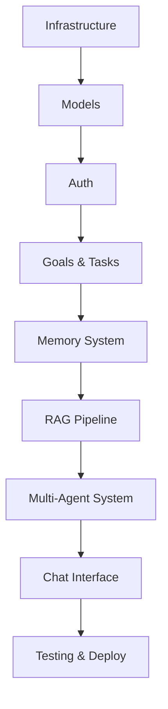

# 📅 Development Timeline - Hermes AI OS

## Visual Timeline (16 Weeks)

```
Week 1  │ ████████ Phase 1: Infrastructure Setup
Week 2  │ ████████ Phase 2: Core Data Models
Week 3  │ ████████ Phase 3: Authentication & Users
Week 4  │ ████████ Phase 4: Goals & Tasks (Part 1)
Week 5  │ ████████ Phase 4: Goals & Tasks (Part 2)
Week 6  │ ████████ Phase 5: Memory System (Part 1)
Week 7  │ ████████ Phase 5: Memory System (Part 2)
Week 8  │ ████████ Phase 6: RAG & Documents (Part 1)
Week 9  │ ████████ Phase 6: RAG & Documents (Part 2)
Week 10 │ ████████ Phase 7: Multi-Agent (Part 1)
Week 11 │ ████████ Phase 7: Multi-Agent (Part 2)
Week 12 │ ████████ Phase 8: Schedule & Routines (Part 1)
Week 13 │ ████████ Phase 8: Schedule (Part 2) + Phase 9: Voice (Part 1)
Week 14 │ ████████ Phase 9: Voice & Analytics
Week 15 │ ████████ Phase 10: Testing & Integrations
Week 16 │ ████████ Phase 10: Deployment & Polish
```

---

## Monthly Breakdown

### Month 1 (Weeks 1-4): Foundation
- ✅ Infrastructure running (Docker, DB, Redis)
- ✅ All database models created
- ✅ Authentication system working
- ✅ Basic goal and task CRUD
- **Demo**: Create goals and tasks via API

### Month 2 (Weeks 5-8): Intelligence Layer
- ✅ AI goal decomposition working
- ✅ Memory system storing and retrieving
- ✅ Document upload and chunking
- ✅ RAG pipeline functional
- **Demo**: Upload doc, ask question, get answer with citations

### Month 3 (Weeks 9-12): Agents & Features
- ✅ All 6 AI agents implemented
- ✅ Multi-agent orchestration
- ✅ Chat interface with context
- ✅ Schedule and routine management
- **Demo**: Full conversation with AI that remembers context

### Month 4 (Weeks 13-16): Voice & Production
- ✅ Voice interface working
- ✅ Analytics dashboard
- ✅ All integrations (Calendar, Notion, GitHub)
- ✅ Deployed to production
- ✅ Full documentation
- **Demo**: Complete portfolio showcase

---

## Critical Path (Must-Do Features)



Priority: A → B → C → D → E → F → G → H → I

**Can be done in parallel after Phase 4:**
- Schedule & Routines
- Voice Interface
- Analytics
- Integrations

---

## Fast Track (10 Weeks)

Skip initially, add later:
- ❌ Schedule & Routines (Phase 8)
- ❌ Voice Interface (Phase 9)
- ❌ Advanced Analytics

Focus on:
- ✅ Infrastructure → Models → Auth
- ✅ Goals & Tasks
- ✅ Memory System
- ✅ RAG Pipeline
- ✅ Multi-Agent System
- ✅ Chat Interface
- ✅ Basic deployment

```
Week 1  │ Phase 1: Infrastructure
Week 2  │ Phase 2: Models
Week 3  │ Phase 3: Auth
Week 4  │ Phase 4: Goals & Tasks
Week 5  │ Phase 4: Goals & Tasks
Week 6  │ Phase 5: Memory (Part 1)
Week 7  │ Phase 5: Memory (Part 2)
Week 8  │ Phase 6: RAG & Docs
Week 9  │ Phase 7: Multi-Agent
Week 10 │ Phase 10: Deploy
```

---

## Daily Schedule Template (Example for Phase 1)

### Week 1 - Phase 1: Infrastructure Setup

**Monday (Day 1)**
- [ ] Morning: Setup `.env`, install dependencies
- [ ] Afternoon: Configure Docker, PostgreSQL, Redis
- [ ] Evening: Test all connections

**Tuesday (Day 2)**
- [ ] Morning: Implement `core/config.py`, `core/logger.py`
- [ ] Afternoon: Implement `core/security.py`, `core/exceptions.py`
- [ ] Evening: Setup telemetry

**Wednesday (Day 3)**
- [ ] Morning: Configure SQLAlchemy `db/session.py`
- [ ] Afternoon: Create database base, migrations
- [ ] Evening: Test database operations

**Thursday (Day 4)**
- [ ] Morning: Setup FastAPI app in `main.py`
- [ ] Afternoon: Configure CORS, middleware, routers
- [ ] Evening: Add health check endpoint, test

**Friday (Day 5)**
- [ ] Morning: Implement `clients/llm_client.py`
- [ ] Afternoon: Implement `clients/embedding_client.py`, caching
- [ ] Evening: Integration testing, fix bugs

**Weekend (Days 6-7)**
- [ ] Review Phase 1 deliverables
- [ ] Write documentation
- [ ] Prepare for Phase 2

---

## Milestone Checklist

### Milestone 1: MVP Backend (Week 5)
- [ ] API server running
- [ ] Database functional
- [ ] Auth working
- [ ] Goals and tasks CRUD complete
- [ ] Can create goal → AI decomposes to tasks

### Milestone 2: Intelligence (Week 9)
- [ ] Memory system working
- [ ] RAG pipeline functional
- [ ] Can upload document and ask questions
- [ ] Multi-turn conversations maintain context

### Milestone 3: Multi-Agent (Week 11)
- [ ] All 6 agents implemented
- [ ] Orchestrator routes correctly
- [ ] Complex queries work (multi-agent coordination)
- [ ] Chat interface complete

### Milestone 4: Full Features (Week 14)
- [ ] Schedule management
- [ ] Routines and habits
- [ ] Voice interface
- [ ] Analytics dashboard

### Milestone 5: Production (Week 16)
- [ ] All tests passing (>80% coverage)
- [ ] Deployed to cloud
- [ ] Documentation complete
- [ ] Demo ready

---

## Time Management Tips

**Daily**:
- Code 6-8 hours
- Document as you code
- Test each feature before moving on
- Commit to git with clear messages

**Weekly**:
- Review completed phase checklist
- Demo to yourself (or friend)
- Update documentation
- Plan next phase

**Bi-Weekly**:
- Integration testing
- Performance check
- Refactor if needed
- Update portfolio docs

---

## Commitment Level

**Part-Time (20 hrs/week)**: 20 weeks
**Full-Time (40 hrs/week)**: 10 weeks
**Recommended (30 hrs/week)**: 14-16 weeks

---

## Success Indicators

**By Week 4**: You can create goals and tasks via API
**By Week 8**: You can chat with AI that remembers context
**By Week 12**: All core features working
**By Week 16**: Production deployment live

---

**Track your progress and stay consistent!** 🚀
