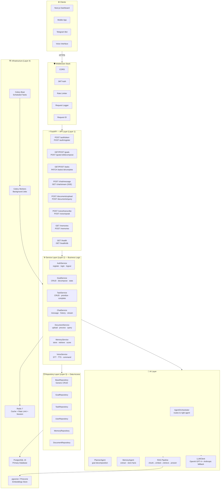
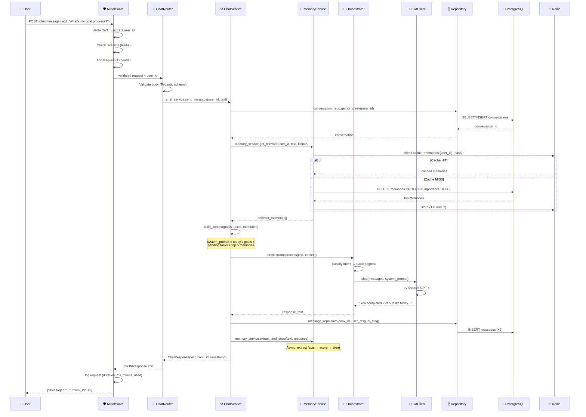
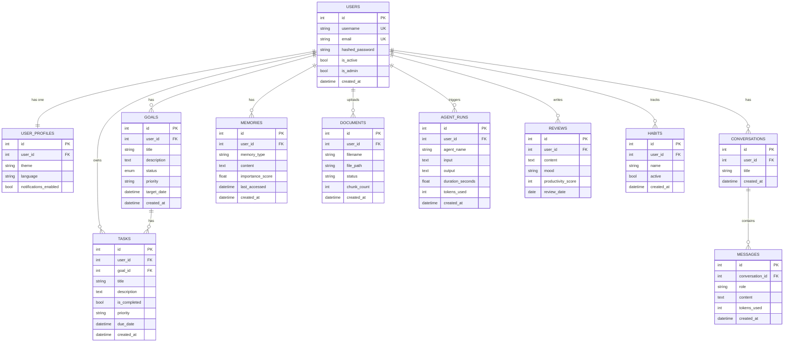
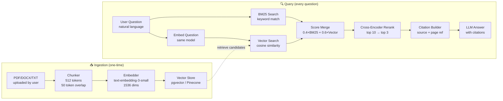
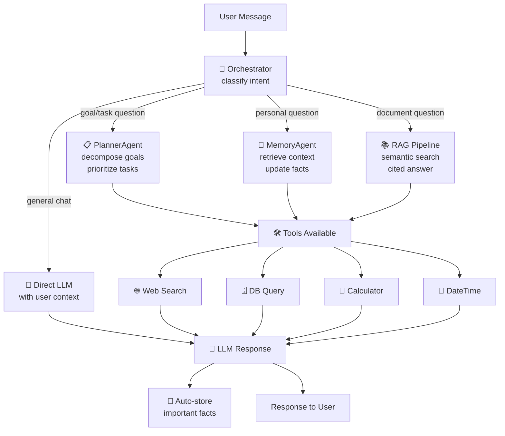
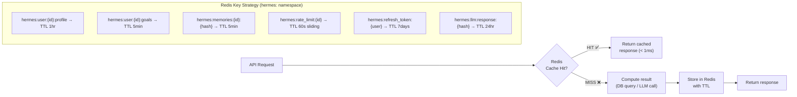

# 🏗️ Hermes AI OS — Clean Architecture
### 50+ LPA Startup-Level System Design

---

## The Core Philosophy

> **One request enters. One response exits. Every layer has exactly one job.**

This is the principle that separates junior code from senior code. Every layer in this system does only one thing and hands off to the next. No layer skips another. No layer knows too much.

---

## 🗂️ The 5-Layer Architecture

```
┌─────────────────────────────────────────────────────────────────┐
│  LAYER 1 — API Layer (FastAPI Routers)                          │
│  Job: Receive HTTP request, validate input, call service,       │
│       return HTTP response. NOTHING ELSE.                       │
├─────────────────────────────────────────────────────────────────┤
│  LAYER 2 — Service Layer (Business Logic)                       │
│  Job: Business rules, validations, orchestrate repositories.    │
│       No SQL. No HTTP concepts.                                 │
├─────────────────────────────────────────────────────────────────┤
│  LAYER 3 — Repository Layer (Data Access)                       │
│  Job: All SQL lives here. Generic CRUD + domain queries.        │
│       No business logic. Just data in/out.                      │
├─────────────────────────────────────────────────────────────────┤
│  LAYER 4 — Infrastructure (DB · Redis · LLM · Vector)          │
│  Job: Connections, connection pools, clients. Config only.      │
├─────────────────────────────────────────────────────────────────┤
│  LAYER 5 — Models + Schemas (Data Contracts)                    │
│  Job: SQLAlchemy ORM (what's in DB). Pydantic (what API sees).  │
└─────────────────────────────────────────────────────────────────┘
```

---

## 🔄 Full System Architecture



---

## 📦 Directory Structure (Clean)

```
Personal-AI-Assistant/
│
├── app/
│   ├── main.py              ← FastAPI app, middleware, router registration
│   │
│   ├── api/                 ← Layer 1: HTTP in/out ONLY
│   │   ├── __init__.py      ← exports all routers
│   │   ├── auth.py          ✅ register, login, refresh, logout, me
│   │   ├── users.py         ✅ profile CRUD
│   │   ├── goals.py         ✅ goal CRUD + stats
│   │   ├── tasks.py         ✅ task CRUD
│   │   ├── chat.py          ❌ NEEDS BUILD — message, stream, history
│   │   ├── documents.py     ❌ NEEDS BUILD — upload, query, list
│   │   ├── memories.py      ❌ NEEDS BUILD — store, retrieve
│   │   ├── voice.py         ❌ NEEDS BUILD — transcribe, speak
│   │   ├── schedules.py     ⚠️  stub
│   │   ├── routines.py      ⚠️  stub
│   │   ├── notifications.py ⚠️  stub
│   │   └── analytics.py     ⚠️  stub
│   │
│   ├── services/            ← Layer 2: Business logic ONLY
│   │   ├── goal_service.py  ✅ full (validation, stats, ownership)
│   │   ├── task_service.py  ✅ full
│   │   ├── user_service.py  ✅ full
│   │   ├── chat_service.py  ❌ NEEDS BUILD
│   │   ├── document_service.py ❌ NEEDS BUILD
│   │   ├── memory_service.py   ❌ NEEDS BUILD
│   │   ├── voice_service.py    ❌ NEEDS BUILD
│   │   └── analytics_service.py ⚠️ stub
│   │
│   ├── repositories/        ← Layer 3: SQL ONLY
│   │   ├── base_repo.py     ✅ Generic CRUD (get, create, update, delete, count)
│   │   ├── goal_repo.py     ✅ + count_active, get_overdue, mark_completed
│   │   ├── task_repo.py     ✅ + count_pending_for_goal, get_by_goal
│   │   ├── user_repo.py     ✅ + get_by_email, get_by_username
│   │   ├── memory_repo.py   ❌ NEEDS BUILD
│   │   └── document_repo.py ❌ NEEDS BUILD
│   │
│   ├── models/              ← SQLAlchemy ORM (what's in DB)
│   │   ├── user.py          ✅ User
│   │   ├── goal.py          ✅ Goal (status enum, relationships)
│   │   ├── task.py          ✅ Task
│   │   ├── memory.py        ✅ Memory (type, importance_score)
│   │   ├── document.py      ✅ Document
│   │   ├── conversation.py  ✅ Conversation
│   │   ├── message.py       ✅ Message
│   │   ├── agent_run.py     ✅ AgentRun (logs)
│   │   ├── review.py        ✅ Review
│   │   └── user_profile.py  ✅ UserProfile, Habit, Routine, Schedule, Notification
│   │
│   ├── schemas/             ← Pydantic (what API sees — no ORM objects)
│   │   ├── user.py          ✅ UserCreate, UserResponse, Token
│   │   ├── goal.py          ✅ GoalCreate, GoalUpdate, GoalResponse
│   │   ├── task.py          ⚠️  basic
│   │   ├── chat.py          ❌ NEEDS BUILD
│   │   ├── document.py      ❌ NEEDS BUILD
│   │   └── memory.py        ❌ NEEDS BUILD
│   │
│   ├── core/                ← Config, security, logging, DI
│   │   ├── config.py        ✅ Settings (pydantic-settings, .env)
│   │   ├── security.py      ✅ JWT create/verify, bcrypt hash/verify
│   │   ├── dependencies.py  ✅ get_db, get_redis, get_current_user
│   │   ├── exceptions.py    ✅ 14KB — comprehensive hierarchy
│   │   └── logger.py        ✅ structured logging
│   │
│   ├── agents/              ← AI Agent System (TO BUILD)
│   │   ├── base_agent.py    ← abstract agent with tool use + retry
│   │   ├── orchestrator.py  ← routes to correct agent
│   │   ├── planner_agent.py ← goal → tasks decomposition
│   │   ├── memory_agent.py  ← extract facts from conversations
│   │   └── tools/           ← web search, calculator, datetime
│   │
│   ├── rag/                 ← RAG Pipeline (TO BUILD)
│   │   ├── chunker.py       ← smart text chunking
│   │   ├── embedder.py      ← OpenAI embeddings
│   │   ├── vector_store.py  ← pgvector / Pinecone
│   │   ├── retriever.py     ← hybrid BM25 + vector search
│   │   └── pipeline.py      ← orchestrate full RAG flow
│   │
│   ├── clients/             ← External API clients
│   │   ├── llm_client.py    ✅ OpenAI GPT-4 + Anthropic fallback + retry
│   │   ├── base_client.py   ✅ abstract base with retry logic
│   │   ├── embedding_client.py ❌ NEEDS BUILD
│   │   └── vector_client.py    ❌ NEEDS BUILD
│   │
│   ├── cache/
│   │   └── redis_client.py  ✅ async Redis, namespaced keys, JSON
│   │
│   └── db/
│       ├── base.py          ✅ SQLAlchemy declarative Base
│       └── session.py       ✅ SessionLocal, engine, init_db
│
├── tests/
│   ├── conftest.py          ✅ pytest fixtures
│   ├── test_auth.py         ✅ auth endpoint tests
│   ├── test_goals.py        ✅ goal CRUD tests
│   ├── test_tasks.py        ✅ task tests
│   ├── test_health.py       ✅ health check tests
│   ├── unit/                ← service-level unit tests (TO BUILD)
│   └── integration/         ← full flow tests (TO BUILD)
│
├── docs/
│   ├── architecture/        ← THIS FILE
│   ├── decision_records/    ← ADRs (TO WRITE)
│   └── benchmarks/          ← perf results (TO MEASURE)
│
├── docker-compose.yml       ← 6 services (fix: port 8001→8000)
├── Dockerfile
├── requirements.txt
├── alembic.ini              ← DB migrations
└── .env                     ← secrets (never commit)
```

---

## 🔄 Request Lifecycle — Step by Step

### Example: `POST /api/v1/chat/message`



---

## 🗃️ Database Schema



---

## 🧠 RAG Pipeline — How Document Q&A Works



**Why this design beats simple RAG:**
| Simple RAG | Hermes RAG |
|-----------|-----------|
| Vector search only | Hybrid BM25 + Vector |
| No reranking | Cross-encoder reranking |
| No citations | Source + page citations |
| Single chunk | Overlapping chunks |

---

## 🤖 Agent Orchestration — How the AI Thinks



---

## ⚡ Caching Strategy



---

## 🛡️ Security Architecture

```mermaid
flowchart TD
    subgraph AUTH_FLOW["Authentication Flow"]
        LOGIN["POST /auth/token<br/>{username, password}"]
        VERIFY["bcrypt.verify()<br/>password hash"]
        JWT_CREATE["create_access_token()<br/>HS256, 30 min"]
        REFRESH_CREATE["create_refresh_token()<br/>stored in Redis, 7 days"]
        LOGIN --> VERIFY --> JWT_CREATE & REFRESH_CREATE
    end

    subgraph REQUEST_AUTH["Every Protected Request"]
        BEARER["Authorization: Bearer {token}"]
        JWT_DECODE["decode JWT<br/>verify signature + expiry"]
        USER_LOAD["load user from DB<br/>check is_active"]
        INJECT["inject User into<br/>route handler via DI"]
        BEARER --> JWT_DECODE --> USER_LOAD --> INJECT
    end

    subgraph RATE_LIMIT["Rate Limiting (Redis)"]
        RL_CHECK["check hermes:rate_limit:{user_id}"]
        RL_COUNT["increment counter"]
        RL_BLOCK["429 Too Many Requests"]
        RL_RESET["auto-reset after 60s"]
        RL_CHECK --> RL_COUNT
        RL_COUNT -->|"> 100 req/min"| RL_BLOCK
        RL_COUNT -->|"ok"| RL_RESET
    end
```



---

## 🏃 Background Jobs (Celery)

```mermaid
gantt
    title Daily Scheduled Jobs (Celery Beat)
    dateFormat HH:mm
    axisFormat %H:%M

    section Morning
    Morning Briefing (goals + tasks summary)    :08:00, 5m
    Embed new documents (nightly catch-up)      :08:05, 10m

    section Daytime
    Goal progress check                          :12:00, 2m
    Habit reminder notifications                 :18:00, 1m

    section Evening
    Evening reflection prompt                    :21:00, 3m
    Memory importance re-scoring                 :22:00, 5m
    Summarize old memories (>30 days)            :22:05, 10m
    Daily analytics calculation                  :23:00, 5m
```



**One-off async jobs (triggered by API):**
- `process_document_task` → chunk + embed after upload
- `decompose_goal_task` → AI breakdown after goal creation
- `send_notification_task` → push notification delivery

---

## 📊 Current vs Target State

| Component | Current | Target | Gap |
|-----------|---------|--------|-----|
| API Routes active | 4/14 | 14/14 | 🔴 Register all in main.py |
| RAG Pipeline | Empty | Full hybrid search | 🔴 Build from scratch |
| Chat API | 0 bytes | Stream + history | 🔴 Build from scratch |
| Memory Service | 0 bytes | Importance scoring | 🔴 Build from scratch |
| Voice STT/TTS | Stub | Whisper + TTS | 🔴 Wire existing config |
| Agent System | None | 4 agents + tools | 🔴 New directory |
| Integration Tests | 0 | >80% coverage | 🟡 Build alongside features |
| Prometheus Metrics | Not wired | p50/p95/p99 tracking | 🟡 Add to middleware |
| ADRs | 0 | 5+ documents | 🟡 Write in parallel |
| Docker Port | 8001:8000 ⚠️ | 8000:8000 | 🟢 2-min fix |

---

## 🔑 Key Interview Talking Points from This Architecture

### 1. Why Repository Pattern?
> *"Service layer doesn't know if data comes from PostgreSQL, MongoDB, or a mock. In tests, I swap `GoalRepository` for `MockGoalRepository` — zero test DB needed. This is the Dependency Inversion principle in practice."*

### 2. Why Hybrid RAG (BM25 + Vector)?
> *"Pure vector search misses exact keyword matches like product names or error codes. BM25 catches those. Vector handles semantic similarity. Combined with cross-encoder reranking, I get precision + recall. My hybrid score: `0.4 × BM25 + 0.6 × Vector`."*

### 3. Why not LangChain?
> *"LangChain adds abstraction over abstraction. When something breaks, you're debugging their code, not yours. I built thin wrappers directly over the OpenAI SDK — I know exactly what every line does. In production, that matters."*

### 4. Why Redis for Rate Limiting?
> *"A sliding window counter in Redis is atomic via INCR + EXPIRE. PostgreSQL would add 2 DB round-trips per request. Redis does it in <1ms. I also use Redis for refresh tokens — centralised invalidation on logout without DB hits."*

### 5. Why Celery + Beat for Background Jobs?
> *"Morning briefings, memory scoring, document processing — none of these should block the API response. Celery separates compute from the request lifecycle. Beat gives me cron-like scheduling without a separate cron container."*

---

## 🚦 Build Order (What to Build First)

```
Week 1 ──► Fix port bug → RAG pipeline → Document API
Week 2 ──► Chat API (with streaming) → Memory Service
Week 3 ──► Agent Orchestrator → Planner Agent → Tools
Week 4 ──► Voice (Whisper + TTS) → Goal AI Decompose → Celery jobs
Week 5 ──► Prometheus metrics → Integration tests → Rate limiting
Week 6 ──► Frontend dashboard → ADRs → Deploy → Blog post
```

---

> **This architecture is intentionally simple at each layer boundary, but sophisticated in how the layers compose.**
> That's what 50+ LPA engineering looks like.
